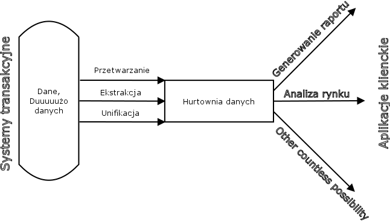

# Lab 1

### Pierwsze zajęcia polegały na:
  - stworzeniu bazy danych w mssql server (wyklikanie tego w VisualStudio, meh)
  - zaczytaniu trzech tabel z pliku xls przez data-flow
  - ogarnięciu spinania wszystkich narzędzi micro$oft do kupy, VS, ms sql server, sql server data tools itd.

### Notatka po mini-wykładzie:
# Hurtownie danych - lab 1

Strona prowadzącego: [Hurtownie Sędziwy](http://galaxy.agh.edu.pl/~sedziwy/wordpress/?page_id=1436),
hasło do treści: [`h12017`]()

Kilka definicji **Hurtowni danych**:
1. Hurtownie danych - sql dla dużych firm (lol)
2. Hurtownia - [`Bill Inmon`](https://pl.wikipedia.org/wiki/Bill_Inmon) - jest zorientowaną podmiotowo, zintegrowaną, trwałą i prezentującą wymiar czasowy kolekcją danych wspierających proces decyzyjny.
3. Hurtownia - [`Ralph Kimball`](https://pl.wikipedia.org/wiki/Ralph_Kimball) - jest strukturalnie przystosowaną do wykonywania efektywnych zapytań i przeprowadzania analiz kopią danych tranzakcyjnych.

Właściwości **hurtowni danych**:
1. rozpatrujemy strategię, proces zarządzania
2. kadra zarządzająca jest klientem hurtowni danych
3. nie ma potrzeby szybkiej aktualizacji danych
4. dane trzymane w hurtowni są przetworzone
5. bardzo złożone analitycznie zapytania `SQL`
6. nie jest potrzebna wydajność dla wielu urzytkowników,
7. potrzebna jest wydajność dla pojedyńczych zapytań
8. Nic co wpadnie do hurtowni, z niej nie znika, archiwum nie jest czyszczone
9. można kumulować dane, agregować, pomijać nie istotne

