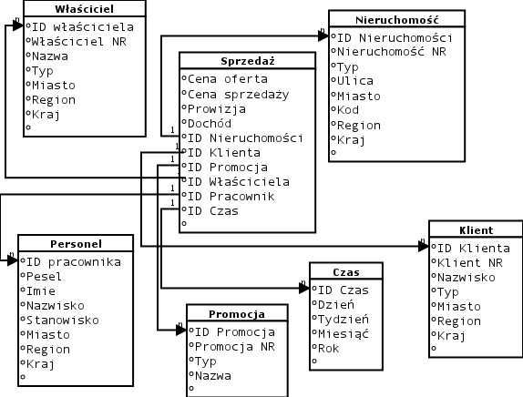

# Hurtownie danych - lab 2

Strona prowadzącego: [Hurtownie Sędziwy](http://galaxy.agh.edu.pl/~sedziwy/wordpress/?page_id=1436),
hasło do treści: [`h12017`]()

### Jak się projektuje hurtownie danych?

Hurtownie danych można tworzyć w kilku schematach:
1. [`Schemat gwiazdy`](http://datawarehouse4u.info/Architektura-schematu-hurtowni-danych-schemat-gwiazdy.html) - zdenormalizowany - dane redundantne
2. [`Schemat płatka śniegu`](http://datawarehouse4u.info/Architektura-schematu-hurtowni-danych-schemat-platka-sniegu.html) - znormalizowany - likwiduje redundancje
3. [`Schemat hybrydowy`](http://datawarehouse4u.info/Architektura-schematu-hurtowni-danych-schemat-konstelacji-faktow.html)- łączy oba powyższe

**Normalnie** jest tworzona w schemacie **gwiazdy**:
 - tabela faktów
     - **Jedna tabela**, ale nie zawsze. Jeżeli występuje **więcej niż jedna** tabela faktów, na pewno **nie ma połączeń** między nimi.
     - **klucz główny** powinien być **złożony z kluczy tabeli wymiarów**
     - posiada klucz oraz odpowiednie **dane numeryczne** *(zazwyczaj)*
 - tabela wymiarów (proste klucze główne) (wiele)
     - **wiele tabel**
     - **proste klucze główne**
     - posiada klucz oraz zazwyczaj **dane opisowe**
     - m. in jest np tabela czas która ma przyspieszyć wykonywanie zapytań
     - w tych tabelach występują często **klucze zastępcze** (Dodajemy własne ID nawet jeżeli jest jakieś z systemu tranzakcyjnego. Uniezależniamy się od formatu bazy pierwotnej z której bierzemy dane)
  - dane zazwyczaj **są redundantne** (nie są normalizowane bo efektywność zapytań)

(tabela lokalizacja dodana w trakcie zajęć, jako dodatkowy rysunek. Odnosi się do personelu, w ten sposób możemy uzyskać schemat płatka śniegu)
