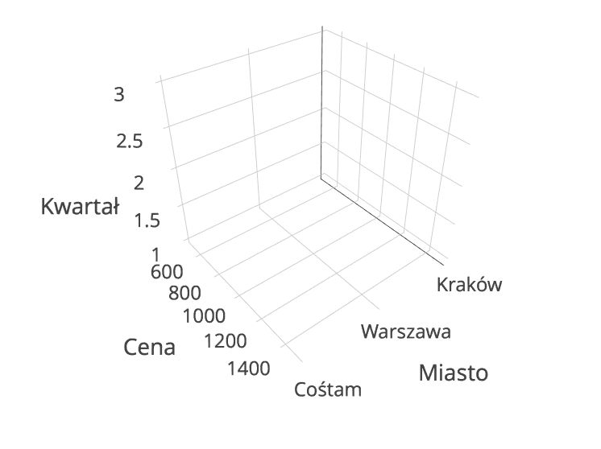

# Hurtownie danych - lab 4

Strona prowadzącego: [Hurtownie Sędziwy](http://galaxy.agh.edu.pl/~sedziwy/wordpress/?page_id=1436),
hasło do treści: [`h12017`]()

### Projekt
1. 40% oceny końcowej
2. bierzemy excela z pierwszych zajęć i robimy hurtownie z tych danych (+ napisać jeżeli czegoś brakuje to dołożyć wirtualne dane), schamat + opis czego używamy itd
3. oceniana będzie poprawność kostki (zgodność z zasadami z zajęć) i "przydatność na produkcji)
4. zaproponować trójwymiarową kostkę (BEZ TEGO NIE DOSTANIESZ ZALICZENIA CEPIE)
5. wysyłamy na porzycki małpka agh.edu.pl to do 8 maja, 23:55 i ani minuty dłużej

### OLAP (OnLine Analytical Processing)
dzieli się na:
  - ROLAP
      - relational OLAP
      - nie jest webscale (lol) (nie skaluje się)
  - MOLAP
      - multidimensional OLAP
      - zazwyczaj NoSQL, redundancja itd (to wszystko z poprzednich zajęć)
  - HOLAP
      - Hybrid OLAP
      - rozwiązanie pośrednie, mieszanka MOLAP i ROLAP

### Istnieje taki byt jak "Kostka OLAP"
  
Operacje na kostce:
  - konsolidacja (roll-up)
  - Eksploracja ( drill-down)
  - Krojenie (slice)
  - selekcja (dice)

porównanie MOLAP ROLAP  

Model relacyjny  
<table>
  <tr>
    <th>kwartał</th>
    <th>miasto</th>
    <th>sprzedaż</th>
  </tr>
  <tr>
    <td>1</td>
    <td>Kraków</td>
    <td>1000</td>
  </tr>
  <tr>
    <td>2</td>
    <td>Kraków</td>
    <td>1000</td>
  </tr>
  <tr>
    <td>3</td>
    <td>Kraków</td>
    <td>1500</td>
  </tr>
  <tr>
    <td>4</td>
    <td>Kraków</td>
    <td>1720</td>
  </tr>
  <tr>
    <td>1</td>
    <td>Warszawa</td>
    <td>500</td>
  </tr>
  <tr>
    <td>2</td>
    <td>Warszawa</td>
    <td>2000</td>
  </tr>
  <tr>
    <td>3</td>
    <td>Warszawa</td>
    <td>2500</td>
  </tr>
  <tr>
    <td>4</td>
    <td>Warszawa</td>
    <td>720</td>
  </tr>
  <tr>
    <td>1</td>
    <td>Cośtam</td>
    <td>1000</td>
  </tr>
</table>

Model nie relacyjny (na kostce)  
<table>
  <tr>
    <th>kwartał\cena</th>
    <th>1000</th>
    <th>500</th>
    <th>1500</th>
    <th>cena/rodzaj</th>
  </tr>
  <tr>
    <td>1</td>
    <td>2000</td>
    <td>2000</td>
    <td>...</td>
    <td></td>
  </tr>
  <tr>
    <td>2</td>
    <td></td>
    <td></td>
    <td></td>
    <td></td>
  </tr>
  <tr>
    <td>2</td>
    <td></td>
    <td></td>
    <td></td>
    <td></td>
  </tr>
  <tr>
    <td>4</td>
    <td></td>
    <td></td>
    <td></td>
    <td></td>
  </tr>
  <tr>
    <td>2016</td>
    <td></td>
    <td></td>
    <td></td>
    <td></td>
  </tr>
  <tr>
    <td>kwartał\miasto</td>
    <td>Kraków</td>
    <td>Warszawa</td>
    <td>Cośtam</td>
    <td>miasto\rodzaj</td>
  </tr>
</table>

Wizualizacja kostki na wykresie

