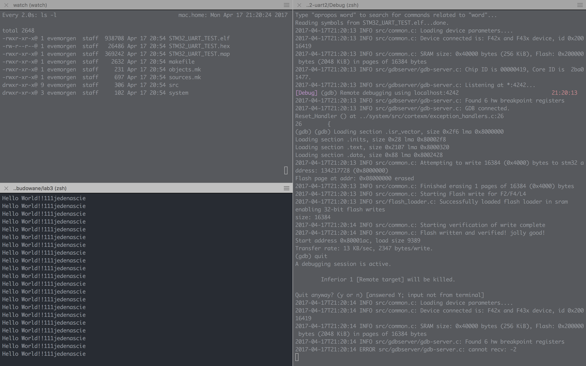

# Lab 3.

Projekt ```stm32-uart2``` jest przykładem wysyłania hello world przez U(S)ART <br>

Ponieważ nie mogłem się dogadać z tym chorym IDE, pracuję w układzie:
- eclipse - na jednym ekranie, służy tylko do budowania projektu
- terminal z 3 pane'ami na drugim ekranie
  - 1 pane ```watch ls -l``` - sprawdzenie czy zbudowany elf jest nowy bo eclipse nie zawsze chce przebudować elfa..
  - 2 pane ```./skrypcior.sh ...``` - wrzucanie nowego elfa na płytkę
  - 3 pane ```sudo cu -l /dev/tty.usb_serial_tty -s baud-rate``` - serial monitor

## Jak to uruchomić:
1. Budujemy cały projekt w Eclipsie (meh)
2. Sprawdzamy czy elf się przebudował (data modyfikacji pliku w ls -l)
2. Wrzucamy na płytkę elfa za pomocą skrypciora
``` ./skrypcior.sh stm32-uart2/Debug/STM32_UART_TEST.elf ```
3. Podłączamy Usb-Serial-Converter
  - GND - GND
  - RX - TX (**PD5**)
  - TX - RX (PD6)
4. Restartujemy stma (Czarny guzior na płytce)
5. Patrzymy czy dane przychodzą do cu (```sudo cu -l /dev/tty.PL2303-00001014 -s 9600``` u mnie przynajmniej)

