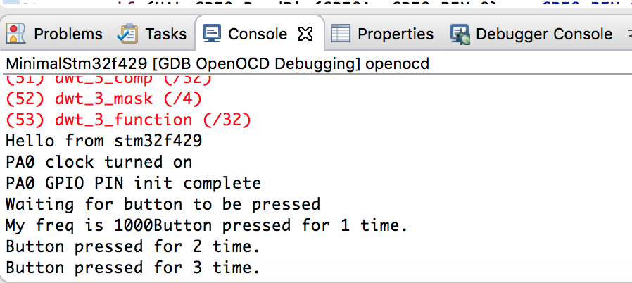
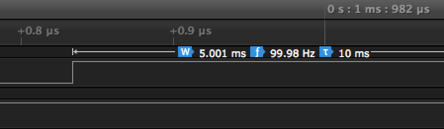

# Lab 4.

Znowu mnie zmusili do używania Eclipsa. Stracić pół dnia na konfigurację tego gunwa, tyle przegrać.  

Lab 4 polegał na zmuszeniu stma do zapisu i odczytu z GPIO, gotowe rozwiązanie jest w GpioStuff (do Eclipsa się zaczytuje jako MinimalStm32cośtamcośtam ale mniejsza o to).  
Protipy:
  - konfiguracja debuggera jest ważna, nie działa out of the box
  - nie zapomnieć włączyć zegara dla danego portu bo nic nie będzie widać
  - trace_printf mi działał tylko z openocd, samo arm-none-eabi-gdb nie wystarcza
  - gdy eclipse podpowiada aby użyć metody jakiejś klasy, a potem uznaje że jej nie ma, trzeba zrobić reindex projektu, meh
  - guzior podpięty pod PA0 to ten niebieski
  - sprawdzić w datasheecie czy dany element nie jest natywnie pull-up/pull-down
  - sprawdzić czy jakiś żartowniś nie zdjął zworki JP3 (ta nad niebieskim guziorem) bo bez niej nic nie działa.

